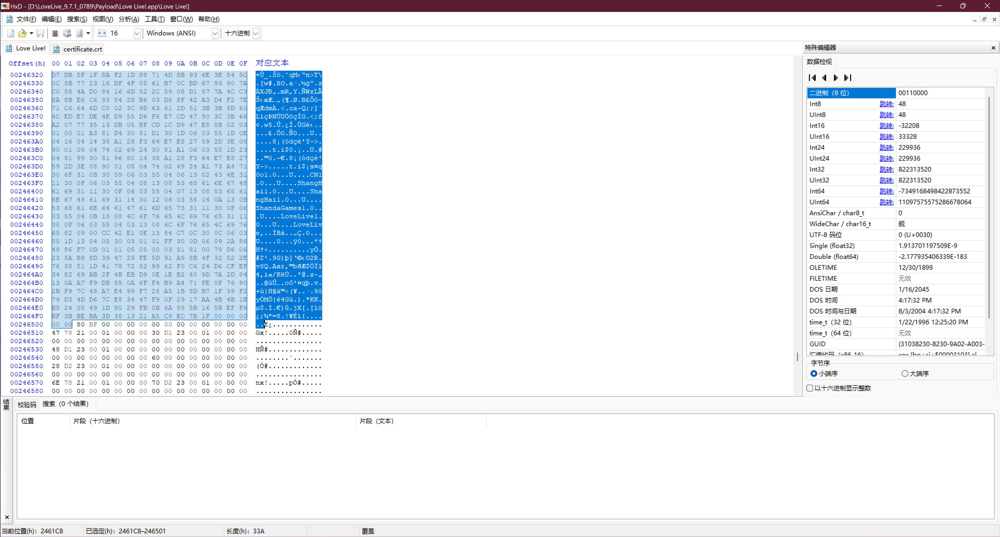
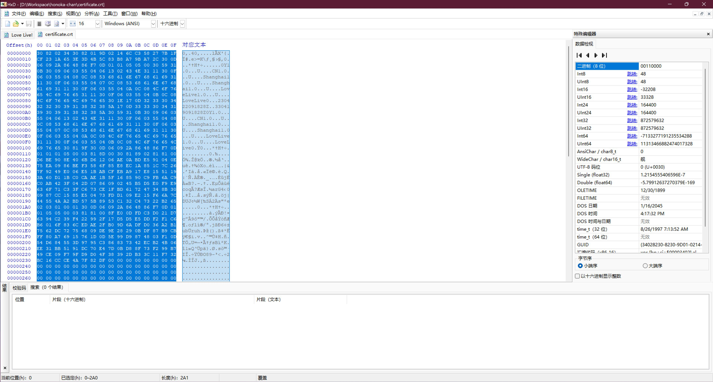
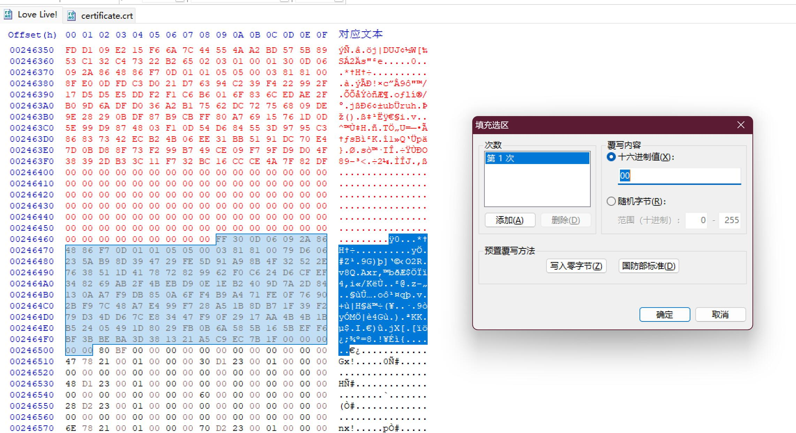

# 客户端修改

SIF 客户端修改分为 Android 和 iOS 两个平台。两边的目标基本一致：

1. 替换盛趣相关接口地址
2. 替换客户端公钥或证书
3. 替换客户端内置的游戏接口地址

## 生成 RSA 密钥对

项目里已经提供了一对 RSA 密钥。如果需要自行生成，可以调用 `encrypt/rsa.go` 中的 `RSA_Gen` 函数，长度必须使用 `1024`。

原因：

- 官方使用的就是 `1024`
- iOS 客户端里有一部分证书内容是直接做 Hex 替换，长度过长会被截断

## 生成 Android 签名所需的 keystore

执行下面的命令生成 keystore：

```bash
keytool -genkeypair -v -keystore sifkey.keystore -alias sifkey -keyalg RSA -keysize 2048 -validity 36500
```

密码自行设置，其他信息可以直接回车。生成后的 `sifkey.keystore` 会在 Android 重新签名时使用。

## Android 客户端修改

### 1. 替换盛趣相关接口地址

使用 Apktool 反编译 APK 后，在 smali 代码里搜索 `sdo.com`，将地址替换成你的服务器 IP 或域名。

参考修改：
https://github.com/YumeMichi/llsif-cn-client/commit/c8dba0c2ad5d274f5d0d8e346808a1b006d137ba

注意：

- 使用 `sed` 批量替换有概率导致重新打包后的 APK 无法使用
- 如果出现问题，建议手动修改

### 2. 替换客户端公钥

理论上也可以直接替换 so 库里的公钥，但 SIF 有多套不同架构的 so，逐个修改比较麻烦，所以更简单的做法是直接在 Java 代码里写死。

参考修改：
https://github.com/YumeMichi/llsif-cn-client/commit/4b36dd48b26467b4dd1e1f479540645788c58f9a

- [llsif-cn-client](https://github.com/YumeMichi/llsif-cn-client) 的文档中也有 so 库的 patch 方法供参考。

### 3. 替换客户端请求接口

SIF 的游戏接口地址写在数据包里，而数据包本身又经过加密。

处理步骤：

1. 在 Apktool 解包目录下找到 `assets/AppAssets.zip`，先解压到临时目录
2. 使用 [libhonoka](https://github.com/DarkEnergyProcessor/libhonoka) 解密其中的 `config/server_info.json`
3. 修改解密后的 `server_info.json`，把 `prod.game1.ll.sdo.com` 替换成你的服务器 IP 或域名
4. 使用 [libhonoka](https://github.com/DarkEnergyProcessor/libhonoka) 重新加密修改后的 `server_info.json`
5. 重新打包 `assets/AppAssets.zip`
6. 更新 `assets/version` 文件里的 MD5 值

修改完成后重新用 Apktool 打包 APK，然后执行签名：

```bash
apksigner sign --ks sifkey.keystore --ks-key-alias sifkey --out signed.apk unsigned.apk
```

## iOS 客户端修改

iOS 客户端需要做的事情和 Android 大体相同，只是位置和修改方式不一样。

### 1. 替换盛趣相关接口地址

先把 IPA 当作 ZIP 解压，进入 `Payload\Love Live!.app`，找到 `Frameworks\ghome_sdk.framework\ghome_sdk`，用 HxD 打开。

搜索 `mgame.sdo.com`，替换成你的服务器 IP 或域名。

注意：

- 替换后的字符串长度必须和原始字符串一致
- 长度不够时需要补 `0`
- 这里长度不一致通常会直接导致客户端崩溃

### 2. 替换客户端公钥和证书

Android 客户端使用的是通过 `/basic/publickey` 获取的 RSA 公钥；iOS 客户端把通信证书写死在二进制里，所以除了私钥，还需要生成证书。

执行：

```bash
openssl req -new -x509 -key privatekey.pem -sha1 -out ca.crt -days 36500
openssl req -new -key privatekey.pem -sha1 -out server.csr
openssl x509 -req -days 36500 -in server.csr -CA ca.crt -CAkey privatekey.pem -CAcreateserial -sha1 -out server.crt
```

其中 `server.crt` 就是后面要用到的证书文件。打开后可以看到是一段 base64 文本，去掉：

- `-----BEGIN CERTIFICATE-----`
- `-----END CERTIFICATE-----`

只保留中间内容，并去掉换行符备用。

接着继续修改 `ghome_sdk` 文件。搜索 `handshake` 附近，可以找到盛趣接口通信使用的证书 base64。该区域长度为十六进制 `384`，也就是十进制 `900`。

处理方式：

1. 将新生成的 `server.crt` 内容补足到 `900` 长度
2. 不足部分用 `A` 填充
3. 替换原始 base64

接下来还需要替换游戏通信使用的证书。iOS 这部分不是 base64，而是证书二进制内容。

可以先把上面的 base64 解码成证书文件，例如：

```go
b, err := base64.StdEncoding.DecodeString(utils.ReadAllText("server.crt"))
if err != nil {
	panic(err)
}
utils.WriteAllText("certificate.crt", string(b))
```

生成的 `certificate.crt` 就是目标证书。把它拖进 HxD，然后进入 `Payload\Love Live!.app`，打开 `Love Live!` 主程序文件。

搜索关键字 `Shanghai`，通常可以很快定位到证书位置。选中证书区域，长度为十六进制 `33A`，也就是十进制 `826`。如果不放心，可以先把选区保存成单独文件，双击确认它确实是一份证书。

替换时注意：

- `certificate.crt` 的长度不能超过 `33A`
- 用新证书内容覆盖原区域
- 不足部分补 `0`

示意图：





### 3. 替换客户端请求接口

iOS 端同样需要修改 `server_info.json`。进入 `Payload\Love Live!.app\ProjectResources\config`，解密 `server_info.json`，把 `prod.game1.ll.sdo.com` 替换成你的服务器 IP 或域名，然后重新加密并替换原文件。

处理完后把整个 `Payload` 目录重新打包成 zip，再把扩展名改回 `.ipa`。然后用爱思助手里的 `IPA 签名` 功能，选择 `使用 Apple ID 签名`，登录自己的账号后开始签名。

最后把签名后的 IPA 安装到设备。

安装后的应用默认无法直接打开，需要到：

`系统设置 -> 通用 -> VPN 与设备管理`

在 `开发者 App` 下信任对应账号后才能运行。个人 Apple ID 签名的有效期通常只有 7 天，到期后需要重新签名安装。
